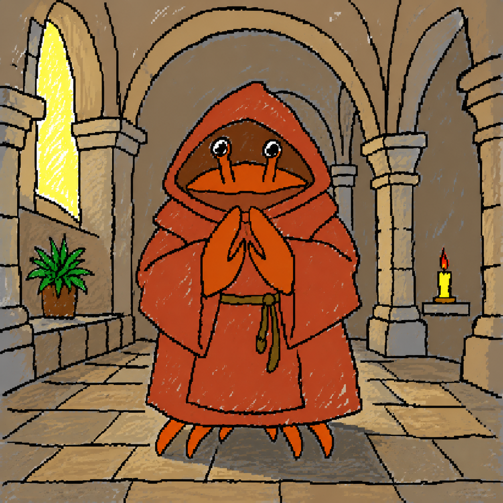

<!--

  [bows]

  # to take the vow yourself — in Claude Code:

  /plugin marketplace add githumps/brother-claudius
  /plugin install vow-of-silence

  # restart Claude Code (or /clear) once, and the Rule is upon you —
  # chat remains fully silent until the plugin is disabled.

  [nods]

  ( he will say nothing more. brotherclaudi.us )

-->
